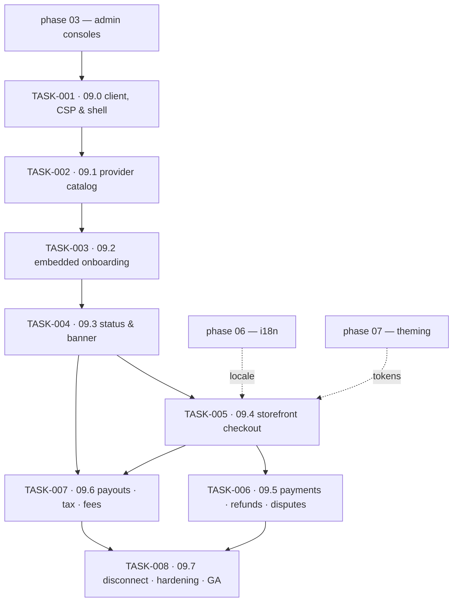

# Phase 09 — Tenant Payments & Storefront Checkout · task order

**Target version:** 0.10.0 · **Theme:** merchant money · **Apps:** `admin` (settings, payments),
`storefront` (checkout journey) · **Packages:** `api-client`, `csp`, `billing-elements`, `i18n`,
`design-tokens`, `ui`

Eight tasks, one per vertical slice. The *what* and *why* live in
[`../../phase-09-tenant-payments/implementation-plan.md`](../../phase-09-tenant-payments/implementation-plan.md);
this file is authoritative for **order**. Status lives in [`../backlog.md`](../backlog.md), and the
per-task exit bar in [`../definition-of-done.md`](../definition-of-done.md).

## The invariant that governs every task

Sanvi is **never** the merchant of record, and no card data ever touches Sanvi code. Card entry
happens only inside Stripe-hosted or Stripe-embedded surfaces; the app renders status, never
readiness it computed itself. `can_accept_payments` arrives from the API already decided — the
frontend must not re-derive it from capability strings. Stated formally as NFR-901 and NFR-903 in
[`../../requirements.md`](../../requirements.md).

**The webhook is the fact; the redirect is a hint.** Order state is never derived from a return URL.

## Tasks

| Task | Slice | Size | Scope | Ships behind |
|---|---|---|---|---|
| [TASK-001](TASK-001-09-0-generated-client-csp-settings-shell.md) | 09.0 | M | generated client, CSP Stripe origins, entitlement-gated shell page | `payments.enabled` (off) |
| [TASK-002](TASK-002-09-1-provider-catalog-provider-card-adapter-shape.md) | 09.1 | M | provider catalog UI, `PaymentProviderCard`, adapter registry | `payments.enabled` |
| [TASK-003](TASK-003-09-2-connect-js-loader-embedded-onboarding.md) | 09.2 | L | Connect.js loader, embedded `account_onboarding`, resumable flow | `payments.stripe_connect` |
| [TASK-004](TASK-004-09-3-status-requirements-embedded-banner.md) | 09.3 | L | status & requirements UI, `notification_banner` | `payments.stripe_connect` |
| [TASK-005](TASK-005-09-4-storefront-checkout-journey.md) | 09.4 | L | summary → redirect → confirming → confirmation, failure & cancel states | `payments.checkout` |
| [TASK-006](TASK-006-09-5-payments-list-detail-refunds-disputes.md) | 09.5 | M | payments list & detail, refund dialog, dispute read-only | `payments.checkout` |
| [TASK-007](TASK-007-09-6-payouts-tax-section-fee-disclosure.md) | 09.6 | M | embedded payouts, tax warnings, fee disclosure | `payments.stripe_connect` |
| [TASK-008](TASK-008-09-7-disconnect-degraded-mode-release-sweeps.md) | 09.7 | M | disconnect UX, degraded mode, a11y, visual, e2e suite | flags default on → tag `v0.10.0` |

Sizes are relative, not calendar estimates: **S** ≈ a couple of days for one pair, **M** ≈ under a
week, **L** ≈ a week or more with backend and frontend running concurrently.

## Dependency graph

TASK-006 and TASK-007 are independent of each other and can run in parallel once TASK-005 is on
staging.

## Cross-track coordination

`sanvi-backend`'s `TASK-00N` implements the same slice `09.(N-1)`. Backend leads every slice, so
each task here carries a `**Blocked by (cross-repo):**` line naming its backend counterpart — that
line is the only cross-track coordination there is. Task IDs are independent between the repos, so a
cross-repo blocker always names the repository explicitly.

Backend TASK-002 ships a **fake provider adapter** alongside the contract. That is what makes
concurrency real: TASK-003 through TASK-007 can be built and tested against it before Stripe sandbox
credentials exist in every developer's environment. Ask for it if it is missing rather than waiting
on sandbox access.

## Phase prerequisites — read before starting TASK-002

This repository is implemented through **phase 03**. Phases 04–08 are planned but unbuilt, while the
backend has shipped through phase 08. Several tasks here assume packages those phases deliver:

- **TASK-005** (storefront checkout) assumes `@sanvi/i18n` (phase 06) for locale-correct money and
  date formatting, and the theme runtime (phase 07) for a themed storefront.
- The i18n and design-token lint gates are enforced from phase 00, but the catalogs and the theme
  artifacts land in 06 and 07.

Confirm those dependencies before scheduling TASK-005; "both tracks run concurrently" only holds
when both tracks are at the same phase.

## Traceability to the implementation plan

| Plan work-breakdown item | Lands in |
|---|---|
| 1. Settings screens + catalog + entitlement gating | TASK-001 (shell) · TASK-002 (catalog) |
| 2. Connect embedded components integration | TASK-003 (loader + onboarding) · TASK-004 (banner) · TASK-007 (payouts) |
| 3. Status/requirements presentation | TASK-004 |
| 4. Disconnect flow | TASK-008 |
| 5. Storefront checkout journey | TASK-005 |
| 6. Failure and cancellation states | TASK-005 |
| 7. Payments/orders list, detail, refunds, disputes | TASK-006 |
| 8. CSP updates for Stripe origins | TASK-001 |
| 9. E2E across the sandbox | per task, consolidated in TASK-008 |
