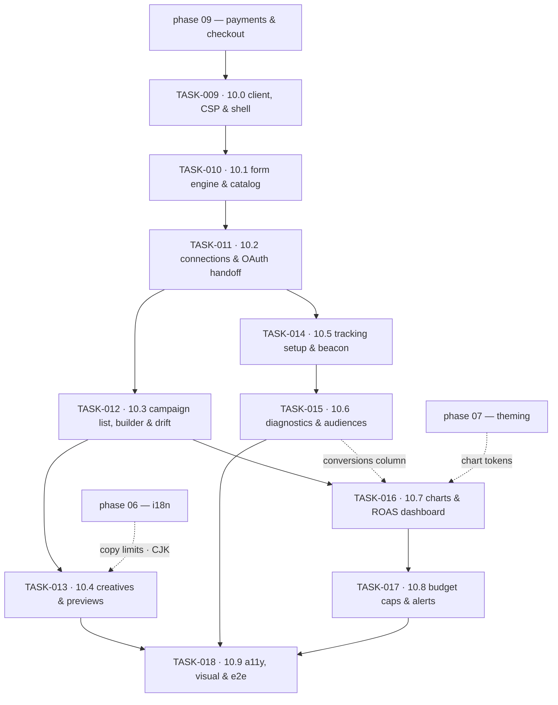

# Phase 10 — Advertising Manager & ROAS Dashboard · task order

**Target version:** 0.11.0 · **Theme:** growth · **Apps:** `admin` (connections, campaigns,
diagnostics, dashboard), `storefront` (tracking beacon) · **Packages:** `api-client`, `csp`, `ui`,
`i18n`, `design-tokens`, `course-media`, `lint-gates`

Ten tasks, one per vertical slice. The *what* and *why* live in
[`../../phase-10-advertising/implementation-plan.md`](../../phase-10-advertising/implementation-plan.md);
this file is authoritative for **order**, slicing, and each slice's exit criteria. Status lives in
[`../backlog.md`](../backlog.md), and the per-task exit bar in
[`../definition-of-done.md`](../definition-of-done.md).

## The invariants that govern every task

**No identifier leaves Sanvi without a live directive that permits it.** The gate itself is backend
work, but this repo carries two obligations that make it real: the storefront beacon is same-origin and
carries a server-issued `event_id` it never mints itself, and the diagnostics screen names the purpose
**and the signal source** behind every suppression rather than flattening them into "tracking error"
(FR-1008, FR-1009).

**Two numbers, never one.** Platform-reported conversion value and Sanvi-observed revenue appear side by
side, labelled at the point of display. No blended KPI tile, chart series, or export column exists
anywhere — grep-asserted (NFR-1002).

**The matrix is the only source.** Field availability, limits, and validation come from the
backend-provided capability matrix. A platform literal in a form path fails the build; a hand-maintained
copy of an objective list is the bug the whole design exists to prevent (NFR-1001).

**Our UI spends the tenant's money.** Budget increases confirm with the actual delta, bulk actions name
what they affect, auto-pause requires typed confirmation, and every spend figure carries its freshness
(FR-1005, FR-1012).

## Tasks

| Task | Slice | Size | Scope | Ships behind |
|---|---|---|---|---|
| [TASK-009](TASK-009-10-0-generated-client-csp-advertising-shell.md) | 10.0 | M | generated client, CSP `ads()` preset, entitlement-gated shell, money/ratio formatters | `advertising.enabled` (off) |
| [TASK-010](TASK-010-10-1-capability-driven-form-engine-catalog.md) | 10.1 | M | capability-driven form engine, `AdPlatformCard`, matrix fixtures, platform-literal gate | `advertising.enabled` |
| [TASK-011](TASK-011-10-2-connection-screens-oauth-handoff-health.md) | 10.2 | L | connection cards, OAuth handoff, account picker, health & re-consent, disconnect | `advertising.google_ads`, `advertising.meta` |
| [TASK-012](TASK-012-10-3-campaign-list-builder-detail-drift.md) | 10.3 | L | campaign list, builder, detail, change log, drift diff | `advertising.google_ads` |
| [TASK-013](TASK-013-10-4-creative-management-placement-previews.md) | 10.4 | L | creative management, placement previews, locale copy limits, cross-platform list | `advertising.meta` |
| [TASK-014](TASK-014-10-5-tracking-setup-storefront-beacon-test-event.md) | 10.5 | L | tracking setup, event map, storefront beacon, one-click test event | `advertising.conversion_tracking` |
| [TASK-015](TASK-015-10-6-conversion-diagnostics-audience-management.md) | 10.6 | M | diagnostics view, reason taxonomy, health banner, audiences | `advertising.conversion_tracking` |
| [TASK-016](TASK-016-10-7-chart-primitives-roas-dashboard.md) | 10.7 | L | chart primitives in `@sanvi/ui`, dashboard, breakdowns, attribution explainer | `advertising.dashboard` |
| [TASK-017](TASK-017-10-8-budget-cap-configuration-alert-surfaces.md) | 10.8 | M | cap configuration, auto-pause explanation, alert history, spend status | `advertising.budget_guardrails` |
| [TASK-018](TASK-018-10-9-a11y-visual-export-hardening-e2e-suite.md) | 10.9 | M | a11y, visual, export hardening, bundle assertions, e2e consolidation | flags default on → tag `v0.11.0` |

Sizes are relative, not calendar estimates: **S** ≈ a couple of days for one pair, **M** ≈ under a
week, **L** ≈ a week or more with backend and frontend running concurrently.

## Dependency graph

Three edges are hard blockers rather than conveniences:

- **TASK-010 → everything after it.** The form engine exists before any campaign screen does. Build the
  builder first and Google's shape becomes the abstraction; Meta then arrives as a pile of special
  cases and TASK-013's "zero new frontend code" criterion is already lost.
- **TASK-014 → TASK-015.** Capture and its gate ship before anything that reports on uploads. Reversed,
  the diagnostics screen is designed around a pipeline whose suppression states do not exist yet.
- **TASK-016 → TASK-017.** The cap progress indicator and every alert figure render restatement-aware
  spend. Before that exists they would render a provisional number as settled — on the screen whose
  whole job is trustworthiness.

TASK-013 and TASK-014 are independent of each other and can run in parallel once TASK-012 is on
staging. Chart primitives in TASK-016 are built against fixtures and can start as soon as TASK-009
fixes the metric shapes.

## Cross-track coordination

`sanvi-backend`'s `TASK-00N`/`TASK-01N` implements the same slice `10.(N-9)`. Backend leads every
slice, so each task here carries a `**Blocked by (cross-repo):**` line naming its backend counterpart —
that line is the only cross-track coordination there is. Task IDs are independent between the repos, so
a cross-repo blocker always names the repository explicitly.

The one edge running the other way is TASK-018: backend TASK-018 cannot tag `v0.11.0` until this repo's
TASK-018 is also done.

Backend TASK-010 ships a **fake adapter with three asymmetric capability matrices**. That is what makes
concurrency real: TASK-011 through TASK-013 can be built and tested against it before Google
developer-token approval and Meta app review land, and the third matrix is what proves in TASK-013 that
a new network needs no frontend release. Ask for those fixtures if they are missing rather than waiting
on platform approvals.

## Phase prerequisites — read before starting TASK-012

Several tasks assume packages earlier phases deliver: `@sanvi/i18n` (phase 06) for locale-correct money,
number, and CJK handling — used inside charts in TASK-016 and inside placement previews in TASK-013 —
and the theme runtime (phase 07) for chart tokens and preview theming. The i18n and design-token lint
gates are enforced from phase 00, but the catalogs and theme artifacts land in 06 and 07. Confirm those
dependencies before scheduling TASK-013 and TASK-016.

## Traceability to the implementation plan

| Plan work-breakdown item | Lands in |
|---|---|
| 1. Connection screens, OAuth handoff, account picker, health | TASK-011 |
| 2. Capability-matrix-driven form engine | TASK-010 |
| 3. Campaign list, builder, detail, change log | TASK-012 |
| 4. Creative management, previews, locale copy limits | TASK-013 |
| 5. Chart primitives in `@sanvi/ui` | TASK-016 |
| 6. Dashboard composition, breakdowns, comparisons, export | TASK-016 · export hardened in TASK-018 |
| 7. Attribution/methodology explainer | TASK-016 |
| 8. Tracking setup + diagnostics + test event | TASK-014 (setup, beacon, test event) · TASK-015 (diagnostics) |
| 9. Budget guardrails and alert surfaces | TASK-017 |
| 10. E2E across both platforms + sandbox smoke | per task, consolidated in TASK-018 |

## Release plan

Each task tags a prerelease off the phase branch (`v0.11.0-alpha.N`) so staging always has a nameable
artifact. `v0.11.0` is tagged by backend TASK-018, only once every task in both repos is `done` and the
flags are on by default.
