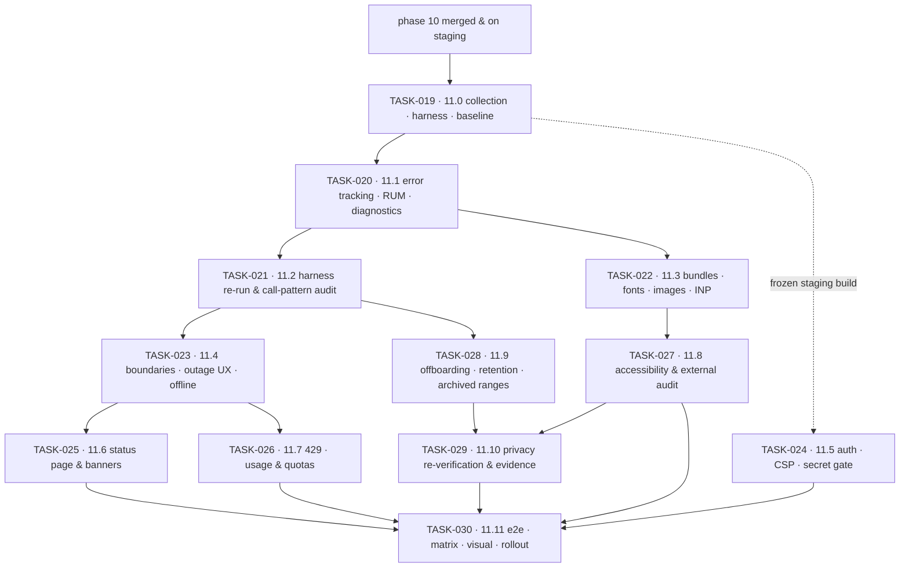

# Phase 11 — Performance, Accessibility & GA · task order

**Target version:** 1.0.0 · **Theme:** ship it · **Apps:** all four (`storefront`, `admin`,
`platform-admin`, `marketing`) · **Packages:** `telemetry` (new), `api-client`, `ui`, `csp`, `i18n`,
`design-tokens`, `lint-gates`

Twelve tasks, one per vertical slice. Unlike phases 09 and 10, each slice ends with a number, a recorded
manual pass, or a published statement rather than a feature. The *what* and *why* live in
[`../../phase-11-hardening-ga/implementation-plan.md`](../../phase-11-hardening-ga/implementation-plan.md);
this file is authoritative for **order**, slicing, and each slice's exit criteria. Status lives in
[`../backlog.md`](../backlog.md), and the per-task exit bar in
[`../definition-of-done.md`](../definition-of-done.md).

## The invariants that govern every task

**Field data decides.** Core Web Vitals are judged at p75 in RUM over at least a week on the new build.
Lighthouse is the regression guard, not the goal — a build can score 100 in the lab and still be slow for
the tenant with a heavy theme and a CJK font, and that tenant is the one the targets are set by
(NFR-1101, NFR-1102).

**Baseline first, gate second.** TASK-019 turns on collection and runs all three harnesses
**reporting-only**; budgets start blocking in TASK-022 and axe in TASK-027. A gate switched on before a
baseline exists is a gate someone disables in week one (NFR-1107).

**An absence is never rendered as a zero.** Stale content says what is stale, a degraded response says it
is degraded, an archived range says it is archived, and a tenant under restore is told so. Every async
surface has loading, empty, error, and success states and a timeout — audited route by route, not
asserted (NFR-1105).

**No new features.** Phase 11 ships no user-facing capability except TASK-026's usage and quota surfaces,
which exist because a limit users cannot see is a support ticket with extra steps (NFR-1106).

## Tasks

| Task | Slice | Size | Scope | Ships behind |
|---|---|---|---|---|
| [TASK-019](TASK-019-11-0-field-collection-ci-budget-harness-baseline-c.md) | 11.0 | M | RUM on in staging/beta, CI budget + Lighthouse + axe harnesses (reporting-only), pinned device profiles, release stamping, `rc.1` baseline | none — tooling only |
| [TASK-020](TASK-020-11-1-error-tracking-rum-segmentation-user-facing-d.md) | 11.1 | L | error tracking with private source maps, RUM segmentation, release health, trace id & copy-diagnostics | none |
| [TASK-021](TASK-021-11-2-harness-re-run-client-call-pattern-audit.md) | 11.2 | S | harness re-run after the backend slice, client call-pattern audit, waterfall review | none |
| [TASK-022](TASK-022-11-3-bundles-fonts-images-streaming-ssr-inp.md) | 11.3 | L | bundles, splitting & prefetch, fonts, images, streaming SSR, third-party audit, INP; budgets become blocking | `platform.ssr_cache` (backend) |
| [TASK-023](TASK-023-11-4-error-boundaries-outage-ux-retry-offline.md) | 11.4 | L | error boundaries, per-app outage UX, async-state audit, retry, offline queue, 3G & offline e2e | `platform.degraded_mode` (backend) |
| [TASK-024](TASK-024-11-5-auth-surface-review-csp-tightening-bundle-sec.md) | 11.5 | M | auth-surface review, CSP tightening, bundle secret gate, dependency hygiene, findings remediation | none — findings-driven |
| [TASK-025](TASK-025-11-6-status-page-degraded-banners-restore-in-progr.md) | 11.6 | M | bilingual status page & incident templates, maintenance/degraded banners, restore-in-progress | `platform.status_probes` (backend) |
| [TASK-026](TASK-026-11-7-429-handling-quota-usage-surfaces.md) | 11.7 | M | shared `429` handling, usage & quota surfaces, limit-reached states, platform-admin overrides, client regen | `platform.rate_limits`, `platform.quotas` (backend) |
| [TASK-027](TASK-027-11-8-accessibility-sweep-manual-passes-external-au.md) | 11.8 | L | axe blocking, manual AT passes, focus management, forms, charts, theme contrast gate, external audit, statement | axe gate blocking |
| [TASK-028](TASK-028-11-9-offboarding-retention-archived-range-surfaces.md) | 11.9 | M | offboarding console with two-person purge confirmation, retention reporting, archived-range messaging | `platform.archival` (backend) |
| [TASK-029](TASK-029-11-10-privacy-centre-re-verification-evidence-acce.md) | 11.10 | M | privacy centre re-verification in both modes, notice diff surfacing, audited evidence pack access | none — evidence slice |
| [TASK-030](TASK-030-11-11-e2e-completion-browser-matrix-visual-baselin.md) | 11.11 | M | e2e completion, browser/device matrix, flake policy, visual baseline, docs, release health watch | → backend tags `v1.0.0` |

Sizes are relative, not calendar estimates: **S** ≈ a couple of days for one pair, **M** ≈ under a
week, **L** ≈ a week or more with backend and frontend running concurrently.

## Dependency graph

Three edges are hard blockers rather than conveniences:

- **TASK-019 → everything.** Four weeks of field data cannot be acquired retroactively. Every later
  claim of improvement is measured against `rc.1`, and without it the whole phase reduces to assertion.
- **TASK-020 → TASK-022.** Segmentation by tenant, locale, device class, and theme revision is what makes
  the scope choice honest. An average hides the tenant with the heavy Japanese font, which is exactly the
  tenant the targets are set by.
- **TASK-022 → TASK-027.** Performance work moves DOM around: lazy boundaries, streaming order, deferred
  hydration. Remediating focus order and live-region behaviour before that lands means auditing it twice,
  and the second audit is the one that gets skipped.

TASK-024 runs on its own track against the frozen staging build and only needs TASK-019, so it can
proceed while TASK-022 and TASK-023 are in flight.

## Parallelism

Phase 11 splits into three tracks that run concurrently after TASK-020:

| Track | Tasks | Owner shape |
|---|---|---|
| Speed | TASK-021, TASK-022, TASK-028 | frontend perf pair working against backend perf |
| Trust | TASK-023, TASK-024, TASK-025 | app owners + security |
| Contract & evidence | TASK-026, TASK-027, TASK-029 | API client owner, a11y owner, privacy owner |

**The external accessibility audit is booked in TASK-019, not in TASK-027.** It is an approval-and-
scheduling queue measured in weeks, it needs a feature-frozen staging build with production-shaped data
to be worth anything, and its findings need a remediation window before GA. A phase that waits until the
relevant task to book it ships late for reasons that have nothing to do with engineering.

## Cross-track coordination

`sanvi-backend` runs a task of the same number for the same slice, so TASK-0NN here pairs with TASK-0NN
there. Every task's **Contract** checklist item is the handshake, and a task blocked on backend work says
so in its `**Blocked by (cross-repo):**` header line.

Backend leads every slice except two:

- **TASK-021** — the backend owns all of slice 11.2's work; this repo owns the harness re-run and the
  client call-pattern audit, and the audit is only useful **before** the backend decides which
  projections to build.
- **TASK-030** — the one edge running frontend-to-backend: the backend cannot tag `v1.0.0` until this
  repo's TASK-030 is done.

Two backend deliverables unblock this repo earlier than the slice order suggests:
`GET /api/v1/system/build` from backend TASK-019 (release stamping for RUM and the error tracker, needed
in TASK-019 here) and the `traceparent` / `trace_id` convention from backend TASK-020 (the trace id every
error screen displays).

## Traceability to the implementation plan

| Plan work-breakdown item | Lands in |
|---|---|
| 1. Performance (bundles, splitting, fonts, images, caching, SSR, third parties, INP) | TASK-022 · measured in TASK-019, TASK-021 |
| 2. Accessibility (audit, focus, forms, charts, theming contrast, external audit) | TASK-027 · privacy surfaces re-checked in TASK-029 |
| 3. Observability (error tracking, RUM, release health, diagnostics, log discipline) | TASK-020 · collection starts in TASK-019 |
| 4. Resilience (error boundaries, outage UX, retry, offline, slow-network e2e) | TASK-023 · status surfaces in TASK-025 |
| 5. Release readiness (browser matrix, e2e, visual regression, release process, docs) | TASK-030 |

The plan has no work-breakdown item for TASK-024, TASK-026, TASK-028, or TASK-029: the first is the
frontend half of the backend's security slice, and the other three are the frontend halves of the quota,
data-lifecycle, and compliance slices.

## Release plan

Each task tags a release candidate off the phase branch (`v1.0.0-rc.N`, N = slice index + 1) so staging
always has a nameable artifact and the external accessibility audit can name the exact build it ran
against. `v1.0.0` is tagged by the backend at the end of its TASK-030, only once this repo's TASK-030 is
also done, both parent plans' acceptance criteria are checked, and both external reports are remediated.
