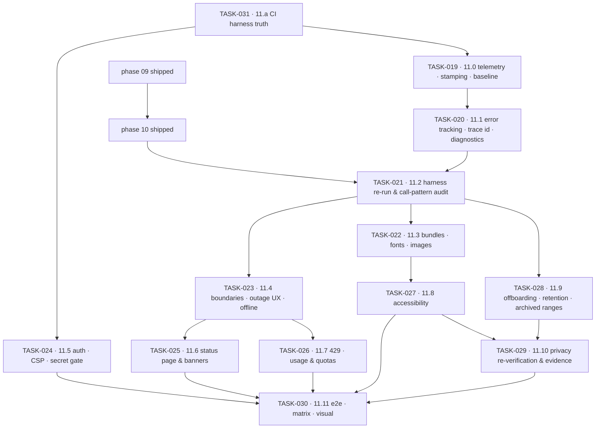

# Phase 11 — Performance, Accessibility & GA · task order

**Target version:** 1.0.0 · **Theme:** ship it · **Apps:** all four (`storefront`, `admin`,
`platform-admin`, `marketing`) · **Packages:** `telemetry` (new), `api-client`, `ui`, `csp`, `i18n`,
`design-tokens`, `lint-gates`

Thirteen tasks. The *what* and *why* live in
[`../../phase-11-hardening-ga/implementation-plan.md`](../../phase-11-hardening-ga/implementation-plan.md);
this file is authoritative for **order**, slicing, and each slice's exit criteria. Status lives in
[`../backlog.md`](../backlog.md), the per-task exit bar in
[`../definition-of-done.md`](../definition-of-done.md), and everything cut from the phase in
[`../../release/needs-humans.md`](../../release/needs-humans.md).

> **For agentic workers:** every task file in this directory is written as an executable plan.
> Use `superpowers:subagent-driven-development` (a fresh subagent per task, review between tasks) or
> `superpowers:executing-plans` (inline). Steps are `- [ ]` checkboxes with a verification command each.
> **Do not tick a step whose verification command has not been run.** A task whose steps are all ticked
> but whose `## Definition of done` still has an unchecked line is not done.

## Read this first

**The GA half below waits on phases 09 and 10 shipping.** It hardens the screens those phases build, so
until they are done the remaining phase 09 and phase 10 tasks — not phase 11 — are this repository's
critical path. Their status is in [`backlog.md`](../backlog.md), which is the only place task status is
recorded; check it rather than a count copied here.

The gate half can start today. Those four tasks build CI harnesses, the telemetry package, and the
security gates, all of which **enumerate** rather than audit: they cover phase 09's and phase 10's work
automatically as it lands, and a budget gate added before the bundles exist is worth far more than one
added after.

## The invariants that govern every task

**Measurements are comparable or they are worthless.** Pinned throttling profiles, a pinned browser
version, committed artifacts, and a comparison that fails on regression. Every number is a **lab**
number and says so — there is no traffic, so "field data decides" has been replaced rather than
pretended (NFR-1101, NFR-1107).

**An absence is never rendered as a zero.** Stale content says what is stale, a degraded response says
it is degraded, an archived range says it is archived, a tenant under restore is told so. Every async
surface has loading, empty, error, and success states and a timeout — audited route by route, not
asserted (NFR-1105).

**Baseline first, gate second.** All three harnesses run reporting-only in TASK-031 and TASK-019;
budgets start blocking in TASK-022 and axe in TASK-027. A gate switched on before a baseline exists is
a gate someone disables in week one.

**No new features.** The single exception is TASK-026's usage and quota surfaces (NFR-1106).

And the rule that decides what belongs in a task file at all: **an acceptance criterion that cannot be
falsified by running a command is not an acceptance criterion.**

## Tasks

### Gate half — startable today

| Task | Slice | Size | Scope | Needs 09/10? |
|---|---|---|---|---|
| [TASK-031](TASK-031-11-a-ci-harness-truth-and-pinned-profiles.md) | 11.a | M | the three harnesses do not exist: create Lighthouse CI, per-route bundle budgets and the axe job, all reporting-only, with pinned profiles | no |
| [TASK-019](TASK-019-11-0-telemetry-package-release-stamping-baseline.md) | 11.0 | M | `packages/telemetry`, directive-gated collector, release stamping from `/system/build`, committed baseline, worst-ten list | no |
| [TASK-020](TASK-020-11-1-error-tracking-trace-id-user-facing-diagnostics.md) | 11.1 | M | error tracking with private source maps, `trace_id` on every error screen, copy-diagnostics, logging discipline | no |
| [TASK-024](TASK-024-11-5-auth-surface-review-csp-tightening-bundle-sec.md) | 11.5 | M | auth-surface review, CSP widenings removed report-only first, bundle secret gate blocking, dependency hygiene | no |

### GA half — needs phases 09 and 10 shipped

| Task | Slice | Size | Scope | Blocked by (cross-repo) |
|---|---|---|---|---|
| [TASK-021](TASK-021-11-2-harness-re-run-client-call-pattern-audit.md) | 11.2 | S | harness re-run, client call-pattern audit, waterfall review | backend TASK-021 |
| [TASK-022](TASK-022-11-3-bundles-fonts-images-streaming-ssr-inp.md) | 11.3 | L | bundles, splitting & prefetch, fonts, images, streaming SSR, third-party audit; budgets become blocking | backend TASK-022 |
| [TASK-023](TASK-023-11-4-error-boundaries-outage-ux-retry-offline.md) | 11.4 | L | error boundaries, per-app outage UX, async-state audit, retry, offline queue, throttled e2e | backend TASK-023 |
| [TASK-025](TASK-025-11-6-status-page-degraded-banners-restore-in-progr.md) | 11.6 | M | bilingual status page & incident templates, maintenance/degraded banners, restore-in-progress | backend TASK-025 |
| [TASK-026](TASK-026-11-7-429-handling-quota-usage-surfaces.md) | 11.7 | M | shared `429` handling, usage & quota surfaces, limit-reached states, client regeneration | backend TASK-026 |
| [TASK-027](TASK-027-11-8-accessibility-sweep-manual-passes-external-au.md) | 11.8 | L | axe blocking, keyboard e2e, focus management, forms, charts, published-theme contrast, statement | backend TASK-027 |
| [TASK-028](TASK-028-11-9-offboarding-retention-archived-range-surfaces.md) | 11.9 | M | offboarding console, retention reporting, archived-range messaging | backend TASK-028 |
| [TASK-029](TASK-029-11-10-privacy-centre-re-verification-evidence-acce.md) | 11.10 | M | privacy centre re-verification in both modes, notice diff surfacing, audited evidence access | backend TASK-029 |
| [TASK-030](TASK-030-11-11-e2e-completion-browser-matrix-visual-baselin.md) | 11.11 | M | e2e completion, browser matrix, flake policy, visual baseline, documentation | → backend tags `v1.0.0` |

Sizes are relative, not calendar estimates: **S** ≈ a couple of days, **M** ≈ under a week, **L** ≈ a
week or more.

## Dependency graph

Four edges are hard blockers rather than conveniences:

- **TASK-031 → everything.** Every later task's acceptance criterion is a number from one of the three
  harnesses, and none of them exist today.
- **TASK-019 → TASK-020.** The error tracker's release tag is the build identity this task establishes.
  Reports that cannot name a build cannot be compared across releases.
- **TASK-021 → TASK-022.** The call-pattern audit is only useful *before* the backend decides which
  projections to build; delivered afterwards it is an interesting document about work already done.
- **TASK-022 → TASK-027.** Performance work moves DOM around — lazy boundaries, streaming order,
  deferred hydration. Remediating focus order and live-region behaviour before that lands means
  auditing twice, and the second audit is the one that gets skipped.

## Parallelism

The four gate tasks are independent of each other after TASK-031, and independent of phases 09 and 10.
In the GA half:

| Track | Tasks |
|---|---|
| Speed | TASK-021, TASK-022, TASK-028 |
| Trust | TASK-023, TASK-025 |
| Contract & evidence | TASK-026, TASK-027, TASK-029 |

## Cross-track coordination

`sanvi-backend` runs a task of the same number for the same slice. Every task's **Contract** step is
the handshake, and a task blocked on backend work says so in its `**Blocked by (cross-repo):**` header.

Backend leads every GA-half slice except two:

- **TASK-021** — the backend owns all of slice 11.2's work; this repo owns the harness re-run and the
  call-pattern audit.
- **TASK-030** — the one edge running frontend-to-backend: the backend cannot tag `v1.0.0` until this
  repo's TASK-030 is done.

Two backend deliverables unblock this repo earlier than the slice order suggests:
`GET /api/v1/system/build` from backend TASK-019 (release stamping, needed in TASK-019 here) and the
`traceparent` / `trace_id` convention from backend TASK-020 (the trace id every error screen displays,
needed in TASK-020 here).

## Traceability to the implementation plan

| Plan work-breakdown item | Lands in |
|---|---|
| 1. CI harness truth | TASK-031 |
| 2. Telemetry package and baseline | TASK-019 |
| 3. Error tracking and diagnostics | TASK-020 |
| 4. Security gates | TASK-024 |
| 5. Harness re-run and call-pattern audit | TASK-021 |
| 6. Performance | TASK-022 |
| 7. Resilience | TASK-023 |
| 8. Status surfaces | TASK-025 |
| 9. Quota surfaces | TASK-026 |
| 10. Accessibility | TASK-027 |
| 11. Data-lifecycle surfaces | TASK-028 |
| 12. Privacy re-verification | TASK-029 |
| 13. Release readiness | TASK-030 |

## Release plan

Each GA-half task tags a release candidate off the phase branch so a harness artifact can name the
exact build it measured. Gate-half tasks merge without an rc tag; they change CI and packages, not
product behaviour. `v1.0.0` is tagged by the backend at the end of its TASK-030, only once this repo's
TASK-030 is also done.
